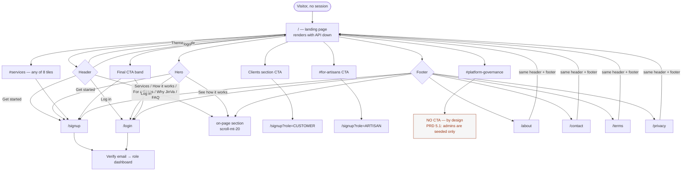
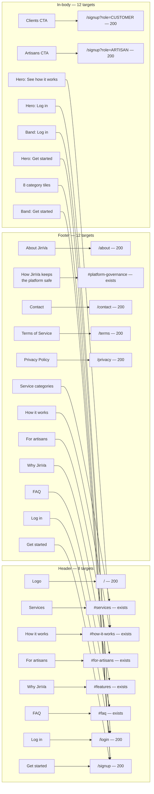
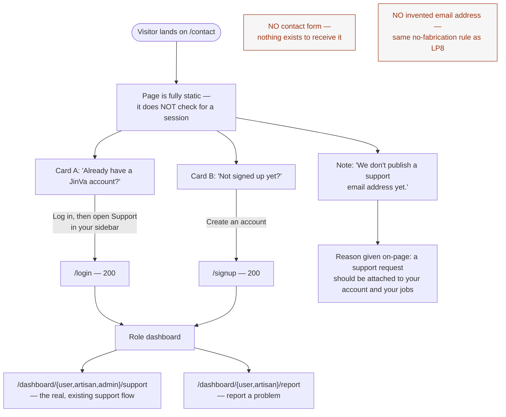

# Routes, Frontend Patterns & Backend Infra — Design Spec

**Author:** ux-designer · **Date:** 2026-08-27 · **Scope:** the flagship marketing landing page at `/`
(LP1–LP14), the shared minimal public layout behind it (PUB1–PUB5), and the DT1 semantic-token +
brand-gradient tokenisation decisions this round says the designer owns.

**Grounded in:** `docs/team/routes-frontend-patterns-backend-infra/requirements.md` in full, with every
"DECISION (user, 2026-08-27)" applied — no open question is re-litigated below. Nothing here invents a
user story the requirements doc doesn't already carry.

**Files read before anything below was proposed:** `src/app/globals.css` (every token, `:root` + `.dark` +
`@theme inline`); `src/app/layout.tsx`; `src/app/page.tsx` (the 5-line redirect being replaced);
`src/middleware.ts` (matcher + `isAuthPage` branch); `src/components/auth/auth-split-layout.tsx` (the
existing marketing visual language); `src/components/logo.tsx`; `src/components/dashboard/header.tsx` (the
theme-toggle `mounted` guard pattern); `src/components/dashboard/layout.tsx` (real spacing rhythm:
`h-16` header, `p-4 md:p-6` main, `gap-4` grids, `rounded-lg`); `src/lib/status-badges.ts` (all five
config maps); `src/lib/utils.ts`; `src/app/dashboard/user/page.tsx` (card/badge conventions);
`src/components/dashboard/support-page.tsx` (the in-dashboard FAQ — read **only** to guarantee none of its
copy is reused and the word "Plumbify" never appears publicly); `src/components/auth/signup-form.tsx`
(role values are exactly `CUSTOMER` / `ARTISAN`); the full `src/components/ui/` inventory (60 primitives);
`package.json` (next 15.5.4, tailwindcss ^4, lucide-react **^0.454.0**, next-themes ^0.4.6, geist ^1.7.2);
`public/` asset inventory; `JinVa-PRD.html` §1–§5, §9, §10; and
`docs/team/analytics-admin-disputes/design-spec.md` + `docs/team/payments-integration/design-spec.md` for
structural precedent.

**No `.env` or `.env.*` file was opened, read, greped or referenced in producing this document.**

---

## 0. What this round is actually designing, and what it is not

The requirements doc's 7-item re-verification table reduces to **two** design surfaces and **one**
design-system decision. Everything else is engineer-mechanical or backend-only.

| Item | Design load |
|---|---|
| LP1–LP14 — landing page at `/` | **The whole job.** §2–§7 below. One mockup at desktop-light, one at mobile-dark. |
| PUB1–PUB5 — `/about`, `/contact`, `/terms`, `/privacy`, on-page FAQ | One shared minimal layout, three content treatments. §8. One mockup. |
| DT1 — success / warning / info tokens | **Designer owns the values.** §1.1, AA-verified with the arithmetic shown. |
| DT4 — brand-gradient tokenisation | **Designer owns the shape.** §1.2. |
| DT2, DT3, DT5 | Engineer-mechanical. §1.3 gives the exact literal → token mapping so nobody invents one. |
| BI1–BI4 | **Zero design surface.** Not mentioned again. |
| R1 (route shape) | Decided by the user: no rename. No design consequence. |

Two things in the requirements doc are worth restating because they shape every decision below:

1. **`/` must render with the backend stopped** (LP2). Consequence: the landing page is a **server
   component with zero data dependencies**. That is why §7 says it has no loading state and no empty
   state, rather than inventing skeletons for content that can never be absent. This is the honest
   application of the four-states rule, not an exemption from it.
2. **`/` is outside `src/middleware.ts`'s matcher today** (`["/dashboard/:path*", "/login", "/signup",
   "/forgot-password", "/reset-password/:path*", "/verify-email"]`). Nothing in this design requires
   widening it, and nothing may. The header shows "Log in / Get started" unconditionally (Open Question 10
   = no session detection).

---

## 1. Design-system decisions the designer owns

### 1.1 DT1 — semantic status tokens (success / warning / info, + one recommended fourth)

**The idiom, first.** The app already has a settled way to express a tinted status pill against a
semantic colour, used today for `--primary` and `--destructive` in `src/lib/status-badges.ts`:

```
bg-<token>/10   text-<token>   border-<token>/20
```

`bookingStatusConfig.CONFIRMED` (`bg-primary/10 text-primary border-primary/20`) and
`paymentStatusConfig.FAILED` (`bg-destructive/10 text-destructive border-destructive/20`) are already
exactly this. **The new tokens extend that idiom rather than introducing a second one**, so each status
needs one authored colour plus a `-foreground` for the rare solid-fill case — mirroring `--destructive` /
`--destructive-foreground` one-for-one. No `-bg` or `-border` token is needed; `/10` and `/20` produce
them.

**A fourth token is required, and here is why.** The existing badge vocabulary uses **two distinct
"not-good-yet" tones that mean different things**, and collapsing them would destroy real information:

- **yellow** = *waiting, nothing is wrong yet* — `bookingStatusConfig.PENDING`, `paymentStatusConfig.PENDING`, `disputeStatusConfig.UNDER_REVIEW`
- **orange** = *needs a human to act, but it is not a failure* — `bookingStatusConfig.NO_SHOW`, `paymentStatusConfig.PENDING_TRANSFER`, `paymentStatusConfig.TRANSFER_FAILED`

DT1 says "at minimum success, warning and info", so a fourth is in scope. I specify `--attention` for the
orange tone. **If the human reviewer prefers three tokens only**, the fallback is: `PENDING_TRANSFER` /
`TRANSFER_FAILED` / `NO_SHOW` all take `--warning`, and the icon alone carries the difference
(`AlertTriangle` / `RefreshCcw` / the label). That fallback is acceptable but strictly worse — see
§11 Q1.

#### Token values — light (`:root`)

| Token | Value | sRGB | Tailwind-palette equivalent |
|---|---|---|---|
| `--success` | `oklch(0.448 0.119 151.328)` | `#166534` | green-800 |
| `--success-foreground` | `oklch(1 0 0)` | `#ffffff` | white |
| `--warning` | `oklch(0.476 0.114 61.907)` | `#854d0e` | yellow-800 |
| `--warning-foreground` | `oklch(1 0 0)` | `#ffffff` | white |
| `--attention` | `oklch(0.470 0.157 37.304)` | `#9a3412` | orange-800 |
| `--attention-foreground` | `oklch(1 0 0)` | `#ffffff` | white |
| `--info` | `oklch(0.424 0.199 265.638)` | `#1e40af` | blue-800 |
| `--info-foreground` | `oklch(1 0 0)` | `#ffffff` | white |

#### Token values — dark (`.dark`)

| Token | Value | sRGB | Tailwind-palette equivalent |
|---|---|---|---|
| `--success` | `oklch(0.792 0.209 151.711)` | `#4ade80` | green-400 |
| `--success-foreground` | `oklch(0.18 0.008 165)` | ≈ `#111412` | = dark `--card` |
| `--warning` | `oklch(0.828 0.189 84.429)` | `#fbbf24` | amber-400 |
| `--warning-foreground` | `oklch(0.18 0.008 165)` | ≈ `#111412` | = dark `--card` |
| `--attention` | `oklch(0.75 0.183 55.934)` | `#fb923c` | orange-400 |
| `--attention-foreground` | `oklch(0.18 0.008 165)` | ≈ `#111412` | = dark `--card` |
| `--info` | `oklch(0.707 0.165 254.624)` | `#60a5fa` | blue-400 |
| `--info-foreground` | `oklch(0.18 0.008 165)` | ≈ `#111412` | = dark `--card` |

Note the dark `-foreground` values are **near-black, not near-white**. `--destructive-foreground` in
`.dark` is `oklch(0.97 0 0)` and gets away with it only because solid destructive fills also apply
`dark:bg-destructive/60`. These four tokens are bright 400-level colours; white text on them would be
around 1.7:1. Dark-on-bright is the only correct pairing and is what is specified.

#### AA verification at badge scale

Method, stated so it can be independently checked: each `oklch` value above is a Tailwind v4 default-palette
entry whose sRGB hex is stable and well known; the WCAG 2.1 relative-luminance formula was applied to
those hexes. Tailwind 4 emits `color-mix(in oklab, <token> 10%, transparent)` for `/10`, which composites
marginally **darker** than the sRGB blend used here for saturated hues — so every ratio below is a slight
over-estimate. That is exactly why no value was chosen at the margin: **every pair clears 4.5:1 by at
least 1.3×.** Engineers should still spot-check one badge per family with a real contrast tool before
closing DT2.

| Pair | Light | Dark |
|---|---|---|
| `text-success` on `bg-success/10` | **6.14:1** ✅ | **8.88:1** ✅ |
| `text-warning` on `bg-warning/10` | **5.90:1** ✅ | **9.22:1** ✅ |
| `text-attention` on `bg-attention/10` | **6.24:1** ✅ | **7.03:1** ✅ |
| `text-info` on `bg-info/10` | **7.40:1** ✅ | **6.29:1** ✅ |
| `-foreground` on solid fill | 6.85 – 8.72:1 ✅ | 7.40 – 11.27:1 ✅ |

Light ratios are measured against `bg-<token>/10` composited over `--background` `oklch(1 0 0)`; dark
ratios against `--card` `oklch(0.18 0.008 165)` (the worse of the two dark surfaces — over
`--background` `oklch(0.13 0 0)` every ratio is higher).

#### Two deliberate choices worth not "fixing" later

- **`--success` is NOT an alias of `--primary`.** JinVa's brand colour is already a deep green, and
  `bg-primary/10 text-primary` is already spoken for by `CONFIRMED` (booking) and `RESOLVED` (dispute).
  If `--success` aliased `--primary`, "Confirmed" and "Completed" would render pixel-identical on the same
  booking list. `--success` is deliberately a **more chromatic, more yellow-green** green
  (oklch C 0.119 / h 151) than `--primary` (C 0.051 / h 160), which is precisely the distinction the
  current `green-700`-vs-`#1c4532` pairing already draws. Keep it.
- **The tokens are one step darker than today's literals.** Today's `bg-green-100 text-green-700` measures
  **4.57:1** — it passes, with 0.07 of headroom, before oklab compositing is accounted for. `bg-yellow-100
  text-yellow-700` and `bg-orange-100 text-orange-700` are around **4.4:1** and **fail**. So DT1 is not
  cosmetic: two of the three existing status tones are below AA today. The light theme will look very
  slightly deeper on status pills after DT2. That is the intended, and the only, visible light-theme
  change — flagged here because the requirements doc's edge-cases section asks for exactly this to be
  surfaced rather than shipped silently.

### 1.2 DT4 — brand-gradient tokenisation (agreed with the landing page)

`auth-split-layout.tsx` hardcodes `bg-gradient-to-br from-[#1c4532] to-[#2d5a42]`. The landing page uses
the same gradient in two places (hero panel, final CTA band), so this has to be one token pair, not two
implementations.

**Why not `from-primary to-primary/80`.** Because the gradient is a **surface**, not an accent. In
`.dark`, `--primary` becomes `oklch(0.62 0.13 165)` — a bright emerald. A full-bleed hero panel and a
full-width CTA band painted in that would be a glowing green slab with white cards floating on it. A
brand *surface* has to stay deep in both themes. So it needs its own token.

```css
/* :root */
--brand: oklab(32.107% -0.04748 0.01739);   /* copy the light --primary string VERBATIM; today's #1c4532 */
--brand-accent: color-mix(in oklab, var(--brand) 84%, white);   /* ≈ today's #2d5a42 */
--brand-foreground: oklch(0.985 0 0);       /* = light --primary-foreground */

/* .dark */
--brand: oklch(0.22 0.04 163);              /* deep green surface; sits below --sidebar's 0.15…0.26 family */
--brand-accent: color-mix(in oklab, var(--brand) 84%, white);
--brand-foreground: oklch(0.97 0 0);
```

- **`--brand` in light must be the byte-identical string already assigned to `--primary`** —
  `oklab(32.107% -0.04748 0.01739)`. Do not re-derive it from `#1c4532`; a round-trip conversion will
  drift and the auth screen will visibly change colour for no reason.
- **`--brand-accent` is derived, not authored**, so the two ends of the gradient can never drift apart.
  `color-mix(in oklab, var(--brand) 84%, white)` lands at oklch L ≈ 0.430 / C ≈ 0.042, within ~1 ΔE of
  today's `#2d5a42`. **If `color-mix()` inside a `@theme inline` token causes any Tailwind 4 build
  problem, substitute the literal `oklch(0.43 0.043 159)`** — same colour, no function call. Verify in
  DevTools that the auth panel is visually unchanged before/after; that is the acceptance test for DT4.
- Usage: `bg-linear-to-br from-brand to-brand-accent` (Tailwind 4 renamed `bg-gradient-to-*` →
  `bg-linear-to-*`; `bg-gradient-to-br` still works as a deprecated alias — use the new name in new code).

**Text on the brand gradient — measured, so nobody guesses:**

| Foreground | On `--brand` (`#1c4532`) | On `--brand-accent` (`#2d5a42`) |
|---|---|---|
| `text-brand-foreground` | **10.79:1** ✅ | **7.92:1** ✅ |
| `text-brand-foreground/80` | 7.8:1 ✅ | **5.76:1** ✅ |
| `text-brand-foreground/70` | 6.6:1 ✅ | **4.84:1** ⚠️ floor |

**Rule for both surfaces: body copy on the brand gradient is `/80`. `/70` is the absolute floor. Never
below `/70`.** This replaces `auth-split-layout.tsx`'s current `text-white/80` (which happens to be
correct) and its `text-white/90` (also fine) with token equivalents, and it forbids the `/60` and lower
that a designer-free hand tends to reach for.

Also in scope for DT4, in the same file: the reusable `<pattern id="grid">` / `<pattern id="dots">` SVG
defs. **Extract them into one component** — `src/components/brand/brand-pattern.tsx` — because the landing
page needs them twice and the auth layout needs them once, and three copies of the same `<defs>` block in
one document produces duplicate SVG `id`s (a real, silent bug: the second `#grid` reference resolves to
the first pattern). The component must generate unique ids (`useId()`) or accept an `idPrefix` prop. The
`stroke="white"` / `fill="white"` inside it becomes `stroke="currentColor"` / `fill="currentColor"` with
the wrapper carrying `text-brand-foreground opacity-10`.

### 1.3 DT2 — the exact literal → token mapping (so no engineer invents one)

Labels are frozen. `HELD` stays **"Withheld"**. Icons unchanged. `notificationTypeConfig` untouched.

| Map | Key | Today | After DT2 |
|---|---|---|---|
| `bookingStatusConfig` | `PENDING` | `bg-yellow-100 text-yellow-700 border-yellow-200` | `bg-warning/10 text-warning border-warning/20` |
| | `CONFIRMED` | `bg-primary/10 …` | **unchanged** |
| | `COMPLETED` | `bg-green-100 …` | `bg-success/10 text-success border-success/20` |
| | `CANCELLED`, `DECLINED` | `bg-red-100 …` | `bg-destructive/10 text-destructive border-destructive/20` |
| | `EXPIRED` | `bg-gray-100 text-gray-600 …` | `bg-muted text-muted-foreground border-border` |
| | `NO_SHOW` | `bg-orange-100 …` | `bg-attention/10 text-attention border-attention/20` |
| `paymentStatusConfig` | `PENDING` | yellow | `bg-warning/10 text-warning border-warning/20` |
| | `HELD` | blue | `bg-info/10 text-info border-info/20` |
| | `PENDING_TRANSFER`, `TRANSFER_FAILED` | orange | `bg-attention/10 text-attention border-attention/20` |
| | `RELEASED` | green | `bg-success/10 text-success border-success/20` |
| | `REFUNDED` | gray | `bg-muted text-muted-foreground border-border` |
| | `CANCELLED` | red | `bg-destructive/10 text-destructive border-destructive/20` |
| | `FAILED` | `bg-destructive/10 …` | **unchanged** |
| `disputeStatusConfig` | `OPEN` | `bg-destructive/10 …` | **unchanged** |
| | `UNDER_REVIEW` | yellow | `bg-warning/10 text-warning border-warning/20` |
| | `RESOLVED` | `bg-primary/10 …` | **unchanged** |
| | `CLOSED` | `bg-gray-100 …` | `bg-muted text-muted-foreground border-border` |
| `disputeOutcomeConfig` | `REFUND_CLIENT` | `bg-red-100 …` | `bg-destructive/10 text-destructive border-destructive/20` |
| | `RELEASE_ARTISAN` | `bg-green-100 …` | `bg-success/10 text-success border-success/20` |
| | `MUTUAL` | `bg-muted …` | **unchanged** |

**One collision to accept knowingly:** after migration, `disputeStatusConfig.OPEN`,
`bookingStatusConfig.CANCELLED` and `disputeOutcomeConfig.REFUND_CLIENT` all render on `--destructive`.
They never appear in the same column of the same table, and each carries a distinct label + icon
(`AlertTriangle` / no icon / `ArrowDownRight`), which satisfies the no-colour-only-signalling rule. Do not
invent a fifth tone to separate them.

### 1.4 Two accessibility findings outside this round's scope, recorded so they get tickets

1. **`bg-primary text-primary-foreground` fails AA in dark mode.** Dark `--primary` is
   `oklch(0.62 0.13 165)`; dark `--primary-foreground` is `oklch(0.97 0 0)`. That measures roughly
   **3.4–3.6:1** (approximated by the method in §1.1 — needs confirming with a real tool). Button label
   text is 14px medium, i.e. normal text, needing 4.5:1. **Every default `<Button>` in the app fails AA in
   dark mode.** Proposed fix, one line: dark `--primary-foreground: oklch(0.16 0.02 165)` → ≈ **5.3:1**.
   This is not in this round's acceptance criteria and I am not folding it in; it needs its own ticket
   because it changes the appearance of every primary button in the product. **The landing page therefore
   never relies on `bg-primary` + small text for anything load-bearing** — its primary CTAs are `size="lg"`
   (16px), which is closer to the large-text threshold, and its brand-surface CTAs use
   `bg-brand-foreground text-brand` (10.8:1).
2. **`rating-stars.tsx`'s `fill-yellow-400 text-yellow-400`** (Open Question 2, still open). The landing
   page's testimonial section renders `<RatingStars>`. Recommendation, so DT5 can just write it down: add
   `--rating: oklch(0.852 0.199 91.936)` (yellow-400) in `:root` and `oklch(0.879 0.169 91.6)` in `.dark`,
   and use `fill-rating text-rating`. A gold star is a *convention*, not a status, so it genuinely wants
   its own token rather than an allowlist entry — and dark mode then becomes controllable. Either answer
   is fine as long as DT5 records one.

---

## 2. Screen inventory

| # | Screen / surface | Route | Status | File the engineer starts in |
|---|---|---|---|---|
| 1 | **Marketing landing page** | `/` | **NEW** — flagship | `src/app/(public)/page.tsx` (delete `src/app/page.tsx`) |
| 2 | **Shared public layout** (header + footer) | wraps 1, 3–6 | **NEW** | `src/app/(public)/layout.tsx`, `src/components/public/{public-header,public-footer}.tsx` |
| 3 | **`/about`** | `/about` | **NEW** | `src/app/(public)/about/page.tsx` |
| 4 | **`/contact`** | `/contact` | **NEW** | `src/app/(public)/contact/page.tsx` |
| 5 | **`/terms`** | `/terms` | **NEW** — draft placeholder | `src/app/(public)/terms/page.tsx` |
| 6 | **`/privacy`** | `/privacy` | **NEW** — draft placeholder | `src/app/(public)/privacy/page.tsx` |
| 7 | **Public error + not-found boundaries** | any `(public)` route | **NEW** | `src/app/(public)/{error,not-found}.tsx` |
| 8 | OpenGraph image | `/` | **NEW** — generated, not an asset | `src/app/(public)/opengraph-image.tsx` |
| 9 | `Logo` — token fix + becomes linkable | everywhere | MODIFIED (content/tokens only) | `src/components/logo.tsx` |
| 10 | `auth-split-layout` — brand tokens + pattern extraction | `/login`, `/signup`, … | MODIFIED (tokens only, §1.2) | `src/components/auth/auth-split-layout.tsx` |
| 11 | `globals.css` — DT1 + brand tokens | — | MODIFIED (tokens only, §1.1–1.2) | `src/app/globals.css` |
| 12 | `status-badges.ts` — DT2 migration | 8 existing screens | MODIFIED (mapping given, §1.3) | `src/lib/status-badges.ts` |
| 13 | `signup-form` — `?role=` prefill | `/signup` | MODIFIED — **engineer only, no design input** (LP13) | `src/components/auth/signup-form.tsx` |
| 14 | `phone-input` — dark-mode fix | 3 forms | MODIFIED — engineer only (DT4) | `src/components/ui/phone-input.tsx` |
| 15 | Root metadata + `/` metadata | — | MODIFIED — copy given in §9 (LP11) | `src/app/layout.tsx`, `(public)/page.tsx` |

**Mockups provided:** `mockups/landing-page.html` (1440px, light — the priority),
`mockups/landing-page-mobile-dark.html` (375px, dark, with the `Sheet` nav open),
`mockups/public-pages.html` (1024px — `/about`, `/terms` draft, `/contact`, and the public 404 side by
side).

**Not mocked, and why:** #6 `/privacy` is pixel-identical to #5 `/terms` with two words changed — mocking
both would be one decision rendered twice. #9–#15 are token/content/functional changes to existing
surfaces with no novel visual decision; §1 gives exact values instead. #8 is a 1200×630 generated image
fully specified by prose in §9.

### Route-group note (important, and easy to get wrong)

Put `/` **inside** the group: `src/app/(public)/page.tsx`. Route groups don't affect the URL, so this
still resolves to `/`, and it is the only way `/` can share `layout.tsx` with the four supporting pages.
`src/app/page.tsx` must be **deleted** in the same commit or Next will report a duplicate-route conflict.
`(public)` sits alongside the existing `(auth)` group with no path collision.

The `(public)/layout.tsx` renders `<PublicHeader />{children}<PublicFooter />` and nothing else — no
width constraint. The landing page needs full-bleed sections; the four prose pages wrap themselves in a
`<PublicProse>` shell (§8.1). Do not put `max-w-3xl` in the layout.

---

## 3. NEW — Marketing landing page at `/`

**Purpose.** Make a visitor who has never heard of JinVa understand it in 10 seconds, believe it in 60,
and sign up.

**Primary users.** Prospective client (homeowner with a broken pipe) and prospective artisan (a carpenter
deciding whether to list). Secondary: anyone evaluating whether the platform is trustworthy enough to put
money through.

**Entry points.** Direct URL / search / a shared link (the OG unfurl, §9). The JinVa logo from anywhere in
the public group. Nothing inside the authenticated app links here.

**Exit points.** `/signup` (primary, from 9 distinct places), `/signup?role=ARTISAN` (artisan CTA),
`/login` (header + final band + `/contact`), `/about`, `/contact`, `/terms`, `/privacy`, and eight on-page
anchors. **Zero `href="#"`. Zero `javascript:void(0)`. Zero 404s.** §6 maps every one.

### 3.1 Page frame

- `<main className="flex flex-col">`; each section is a `<section>` with `py-16 md:py-24` and an inner
  `mx-auto w-full max-w-7xl px-4 sm:px-6 lg:px-8`. Both numbers are on the existing scale (the dashboard
  uses `p-4 md:p-6`; the landing page is one step more generous because it is a marketing surface, not app
  chrome).
- **Section-background rhythm**, alternating so the page has vertical structure without new colours:
  `bg-background` → trust strip `bg-muted/40` → `#services` `bg-background` → `#how-it-works` `bg-muted/40`
  → role sections `bg-background` → `#features` `bg-muted/40` → `#testimonials` `bg-background` → `#faq`
  `bg-muted/40` → CTA band `bg-linear-to-br from-brand to-brand-accent`. `bg-muted/40` is in-idiom
  (`Item variant="muted"` is already `bg-muted/50`).
- **Anchor offsets.** Every anchored section gets `scroll-mt-20` (sticky header is `h-16`). Add to
  `globals.css`:
  ```css
  html { scroll-behavior: smooth; }
  @media (prefers-reduced-motion: reduce) { html { scroll-behavior: auto; } }
  ```
  The reduced-motion guard is not optional — smooth-scrolling a 6000px page is a vestibular trigger.
- **Heading hierarchy** (LP10): exactly one `<h1>` (hero). Every section title is `<h2>`. Cards inside
  sections use `<h3>`. Nothing skips a level. The `Card` primitive's `CardTitle` renders a `<div>`, so
  section headings must be authored as real `<h2>`/`<h3>` elements, not `CardTitle` alone.
- **Motion budget** — inherited verbatim from `auth-split-layout.tsx`, and capped there:
  `transition-all duration-300` on interactive elements, `duration-500` on the two hero card lifts,
  `hover:scale-105` on category tiles and the hero cards only, one decorative blurred orb
  (`blur-3xl`, `bg-linear-to-br from-brand-accent/30 to-transparent`). **No parallax, no scroll-jacking,
  no autoplaying anything, no scroll-triggered reveals.** Every `hover:scale-*` must sit inside a
  `motion-safe:` variant so `prefers-reduced-motion` users get none of it.

### 3.2 Sticky header — `PublicHeader`

`<header className="sticky top-0 z-50 h-16 w-full border-b border-transparent bg-background/80 backdrop-blur transition-all duration-300 data-[scrolled=true]:border-border">`

| Slot | Content | Component |
|---|---|---|
| Left | `<Logo />` wrapped in `<Link href="/" aria-label="JinVa home">` | `Logo` (#9) + `next/link` |
| Centre (`hidden lg:flex`) | Services · How it works · For artisans · Why JinVa · FAQ | `NavigationMenu` + `NavigationMenuLink asChild` |
| Right | theme toggle · "Log in" · "Get started" | `Button` |
| Right (`lg:hidden`) | hamburger → `Sheet side="right"` | `Sheet` + `Button size="icon" variant="ghost"` |

- Nav item styling: `text-sm font-medium text-muted-foreground hover:text-foreground transition-colors`
  plus `focus-visible:ring-ring/50 focus-visible:ring-[3px] rounded-md` — the same focus treatment
  `buttonVariants` already applies, so focus rings look identical to the rest of the app.
- **Theme toggle: copy `src/components/dashboard/header.tsx` lines 78–126 exactly.** `useTheme()`,
  a `const [mounted, setMounted] = useState(false)` + `useEffect(() => setMounted(true), [])` guard, and
  `{mounted && resolvedTheme === "dark" ? <Sun … /> : <Moon … />}` at `h-[1.1rem] w-[1.1rem]`. The guard
  is not stylistic — rendering the icon before mount is a hydration mismatch. `aria-label="Toggle theme"`.
- "Log in" → `Button variant="ghost" asChild` → `/login`. "Get started" → `Button asChild` (default
  variant) → `/signup`.
- **Scroll border.** A 1px border appears once `window.scrollY > 8`. Because this is the *only* reason the
  header needs client JS beyond the toggle and the sheet, and because it must not break SSR, implement it
  as a `data-scrolled` attribute set by a passive scroll listener, with the server-rendered default being
  `border-transparent`. If it turns out to cost a layout-shift, drop it — it is decoration.
- **Mobile `Sheet`** (under `lg`): `SheetContent side="right"` — the primitive's default is
  `w-3/4 sm:max-w-sm`, which is correct at 375px. Contents top-to-bottom: `SheetHeader` with the `Logo`
  and the primitive's own close button; the five nav links as full-width `h-12` rows with a
  `Separator` between groups; a `Separator`; "Log in" (`variant="outline"`, full width); "Get started"
  (default, full width); then a `SheetFooter`-height row with the theme toggle and its text label
  ("Dark mode" / "Light mode") so the icon isn't unlabelled on touch. **Every item closes the sheet on
  selection** (`onOpenChange(false)` in each handler) — LP3 requires it explicitly.

### 3.3 Hero

**Direction chosen: problem-first**, the requirements doc's "strongest" option, traced to PRD §2's
core-gap callout. Refined, not mixed with the other two candidates.

```
h1   Hiring a skilled artisan shouldn't depend on word of mouth.
p    JinVa connects you with verified electricians, plumbers, carpenters, painters,
     cleaners, landscapers and beauty professionals. See their past work and their
     prices before you book, get a real booking and a real payment record, and keep
     your money withheld until you confirm the job is done.
CTA  [ Get started ]  [ Log in ]      See how it works ↓
```

- `<h1 className="text-4xl font-bold tracking-tight text-balance sm:text-5xl lg:text-6xl">`. At 320px the
  longest word is "professionals" — no clipping, and `text-balance` keeps the line breaks sane.
- Supporting `<p className="mt-6 max-w-xl text-lg leading-relaxed text-muted-foreground">`.
- CTAs: `Button size="lg" asChild` → `/signup` ("Get started"); `Button size="lg" variant="outline"
  asChild` → `/login` ("Log in"). Both **above the fold at 1440×900 and at 375×812** (LP4) — at 375 the
  two buttons stack full-width and the hero visual moves below them, which is what keeps them visible.
- Third path: a plain `Button variant="link"` → `#how-it-works`, "See how it works" with a
  `ChevronDown h-4 w-4`. An on-page anchor, so it satisfies LP3.
- **Do not use the word "free."** Signup being free is a pricing claim nobody approved. "Get started" is
  the approved primary label everywhere on this page.

**Hero visual — the brand panel composition.** Right half at `lg`, below the copy at `md` and under.
`rounded-2xl bg-linear-to-br from-brand to-brand-accent p-8` + `<BrandPattern />` at `opacity-10` +
one blurred orb, exactly per §1.2 and the existing auth layout. Floating over it, three white
`rounded-2xl … shadow-2xl` cards (`bg-card`, not `bg-white` — this is the token fix that makes the
composition work in dark mode):

1. **Sample artisan card** (largest, centred): `Avatar` with `public/artisan-in-hard-hat.jpg`, name
   "Kwame Asante", "Plumbing · Accra", a `Badge` with `ShieldCheck` reading "Verified", and a
   `<RatingStars rating={4.8} totalReviews={37} size="sm" />`.
2. **Sample booking chip** (top-right, rotated ~6°, brand-tinted like the existing "JinVa Pro" card):
   "Thu 3 Sep · 9:00–11:00" + a `Badge` on `--success` reading "Confirmed".
3. **Escrow reassurance chip** (bottom-left): `Lock h-4 w-4` + "Payment withheld until you confirm".

**No amounts anywhere in this composition.** The Money section of the requirements doc forbids prices,
fee percentages and "starting from GH₵…" figures on this page, and a mocked-up amount would read as a
real rate. **No aggregate numbers either** — "4.8 (37)" is one sample artisan's rating, which is product
UI; "10,000+ artisans" would be a fabricated platform statistic (LP8) and appears nowhere.

**Imagery.** Only `public/artisan-in-hard-hat.jpg` in the hero. `alt="A JinVa artisan on site"`. The
other three portraits are used once each in §3.6. Nothing on this page requires an asset that doesn't
already exist in `public/`.

### 3.4 Trust strip

Immediately under the hero, `bg-muted/40 py-8`, a 4-up grid (`grid-cols-1 gap-6 sm:grid-cols-2
lg:grid-cols-4`). Each cell: a `size-9 rounded-lg bg-primary/10 text-primary` icon tile (the exact
`EmptyMedia variant="icon"` treatment, retinted) + one line of `text-sm font-medium`.

| Icon | Copy | PRD |
|---|---|---|
| `ShieldCheck` | Artisans verified by JinVa | §5.13 (manual verify grants the badge), §5.3 (badge shown) |
| `Lock` | Payment withheld until you confirm | §5.7 (escrow until completion) |
| `Star` | Reviews only from completed jobs | §5.8 (only a `COMPLETED` job permits a review) |
| `Scale` | Disputes reviewed by our team | §5.13 (dispute resolution) |

**No numbers in this strip.** LP8.

### 3.5 `#services` — Service categories

Section `<h2>`: **"Every trade, one platform."** Sub: "JinVa covers all artisan service categories — if
someone does it as a trade, it belongs here." (PRD §1: "across all trade categories … and more".)

PRD §1 order, exactly, spelling checked: **Electrical, Plumbing, Carpentry, Painting, Cleaning,
Landscaping, Beauty**, then one "and more" tile.

Grid: `grid grid-cols-2 gap-4 sm:grid-cols-3 lg:grid-cols-4`. Each tile is a `Card` wrapped in a
`Link href="/signup"` — **the whole tile is the click target** (LP6), `className="group … transition-all
duration-300 motion-safe:hover:scale-105 hover:border-primary/30 hover:shadow-md"`, with
`focus-visible:ring-ring/50 focus-visible:ring-[3px]` so keyboard users get the same affordance.
Contents: a `size-10 rounded-lg bg-primary/10 text-primary` icon tile, an `<h3 className="text-sm
font-semibold">`, and one `text-xs text-muted-foreground` line of example work.

| Tile | Icon | Example line |
|---|---|---|
| Electrical | `Zap` | Wiring, rewires, faults |
| Plumbing | `Droplet` | Leaks, pipes, water heaters |
| Carpentry | `Hammer` | Fittings, repairs, joinery |
| Painting | `Paintbrush` | Interiors, exteriors, touch-ups |
| Cleaning | `Sparkles` | Homes, offices, post-build |
| Landscaping | `Trees` | Gardens, grounds, clearing |
| Beauty | `Scissors` | Hair, nails, makeup |
| …and every other trade | `LayoutGrid` | Tiling, welding, masonry and more |

**Icon-version caveat:** `lucide-react` is pinned at `^0.454.0`. Every glyph named above exists in that
version. `PaintRoller` and `Grid2x2Plus` (which the requirements doc suggested) may not — verify before
substituting either.

**Icons, not photos**, per the brief: there is no photo for Beauty, Landscaping or Electrical in `public/`,
and one photo tile beside seven icon tiles reads as a rendering fault.

The example lines are illustrative of the category, not a claim that JinVa has an artisan for each right
now — worth knowing if this ever gets challenged in review. If that's uncomfortable, drop the third line
from every tile; the design works without it.

**If Open Question 3 is ever reversed to "live":** the tile list maps over the `GET /services` response
and falls back to the eight tiles above on any failure or empty result, with no toast and no visible
error. The tile shell, grid and hover treatment are unchanged; a `Skeleton` in the tile's exact shape
(`h-10 w-10 rounded-lg` + `h-4 w-24` + `h-3 w-32`) covers the fetch. Designed, not built — the decision
is static.

### 3.6 `#how-it-works` — two journeys, one `Tabs`

Section `<h2>`: **"How JinVa works."**

`Tabs defaultValue="clients"` with a centred `TabsList` — `TabsTrigger` "For clients" / "For artisans".
Each `TabsContent` is a numbered step row: `grid gap-6 md:grid-cols-5` at desktop (5 steps) / `md:grid-cols-3
lg:grid-cols-6` for the artisan journey (6 steps), collapsing to a single vertical column at 375px with a
`border-l border-border pl-6` rail and the step numeral as a `size-8 rounded-full bg-primary
text-primary-foreground` marker sitting on the rail. The numeral is a real `<span>` with the digit, not a
CSS counter, so screen readers read the order.

**For clients** (PRD-traced):

| # | Step | PRD |
|---|---|---|
| 1 | Search verified artisans by trade, location and rating | §5.2 |
| 2 | Check their profile, portfolio and reviews | §5.3, §5.4, §5.8 |
| 3 | Pick an available slot and send a booking request | §5.5 |
| 4 | Pay — your money stays withheld until the job is confirmed complete | §5.7 |
| 5 | Confirm completion and leave a review | §5.6, §5.8 |

**For artisans** (PRD-traced):

| # | Step | PRD |
|---|---|---|
| 1 | Create your profile with your services and your prices | §5.3 |
| 2 | Upload photos and video of work you've already done | §5.4 |
| 3 | Set your weekly hours and block the dates you're away | §5.5 |
| 4 | Accept or decline requests within 24 hours | §5.5 |
| 5 | Get paid to your bank account or mobile wallet | §5.7 |
| 6 | Track your earnings, ratings and repeat clients | §5.12 |

`Tabs` is a client component; its server-rendered HTML contains the default tab's panel, so the client
journey is readable with JS disabled (edge case in the requirements doc). The artisan journey is not,
which is acceptable — but it means the artisan journey must **also** be reachable as prose from the
`#for-artisans` section below, which it is.

### 3.7 Role sections

Three blocks, alternating image/content sides (`lg:grid-cols-2` with `lg:order-*` swapped). Section
headline = the PRD §3 objective for that role; bullets = the PRD §4 key capabilities.

#### 3.7.1 Clients — `bg-background`

- `<h2>` **"Transparent, trustworthy and frictionless access to verified artisans."** (PRD §3, bullet 1 —
  verbatim except for capitalisation.)
- Body: "You shouldn't have to take a stranger's word for it. On JinVa you can see who has been verified,
  what they've built or fixed before, what other clients said after the job was done — and you keep a
  record of the booking and the payment." (PRD §2 client paragraph: cannot evaluate quality, price or
  availability; no reliable booking or payment trail; no recourse.)
- Bullets (`CheckCircle2 h-4 w-4 text-primary` + `text-sm`), PRD §4 "Search, book, pay, review, message,
  dispute" expanded one-for-one:
  Search and filter · Book a real time slot · Pay by card, mobile money or cash · Review after completion ·
  Message your artisan about the job · Raise a dispute if it goes wrong
- CTA: `Button size="lg" asChild` → `/signup?role=CUSTOMER` — **"Get started as a client"**.
- Image: `public/artisan-in-blue-uniform.jpg` in an `AspectRatio ratio={4/3}` inside a
  `rounded-2xl border border-border overflow-hidden`. `alt="An artisan arriving for a JinVa booking"`.

#### 3.7.2 Artisans — `#for-artisans`, `bg-muted/40`

This is the harder side of the marketplace and the section must read as a genuine pitch, not a footnote —
so it gets the most vertical space of the three, its own background band, and a 3-up mini-card row under
the bullets.

- `<h2>` **"Build a professional reputation, manage your own schedule, and get paid reliably."**
  (PRD §3, bullet 2 — verbatim.)
- Body: "Word of mouth doesn't scale, and it doesn't pay on time. JinVa gives you a profile that shows what
  you can actually do, a calendar you control, and a payout that lands in your bank account or mobile
  wallet after the job." (PRD §2 artisan paragraph: inconsistent demand, no-shows, no digital payment
  infrastructure, no way to showcase work, no schedule/reputation tools.)
- Three mini-cards (`Card` with `size-9 rounded-lg bg-primary/10 text-primary` icon + `<h3>` + one line):
  - `Images` — **Show your work.** A portfolio gallery on your public profile. (§5.4)
  - `CalendarClock` — **Own your calendar.** Weekly hours, blocked dates, and a 24-hour window to accept
    or decline. (§5.5)
  - `TrendingUp` — **See what's working.** Earnings, job counts, rating trend and repeat-client rate.
    (§5.12)
- Bullets, PRD §4 "Portfolio, calendar, analytics, messaging, payouts" expanded: A public profile with a
  verified badge · Portfolio uploads reviewed before they go live · Payouts to bank or mobile wallet ·
  In-app messaging scoped to each job · A cancellation policy you set
- CTA: `Button size="lg" asChild` → **`/signup?role=ARTISAN`** — **"List your trade on JinVa"** (LP13).
  If Open Question 6 had gone the other way this would be a bare `/signup`; it didn't, so use the param.
- Image: `public/artisan-in-orange-vest.jpg`. `alt="A JinVa artisan at work on a job"`.

#### 3.7.3 Platform governance — `#platform-governance`, `bg-background`

**No CTA of any kind. No signup link. No "become an admin".** This is LP5's hard fail condition and PRD
§5.1's seed-only rule. The section exists to answer *"why is this marketplace safe?"*, not to sell a role.

- `<h2>` **"Someone is actually checking."**
- Sub: "JinVa has an internal admin team with full visibility into platform activity, and tools to enforce
  quality and resolve disputes." (PRD §3, bullet 3.)
- A 5-up `grid gap-4 md:grid-cols-2 lg:grid-cols-5` of small `Card`s, each an icon + `<h3>` + one line —
  PRD §4 "User mgmt, moderation, transactions, analytics, disputes":
  - `BadgeCheck` — **Identity verification.** Artisans are manually verified before they get the badge. (§5.13)
  - `ClipboardCheck` — **Portfolio moderation.** Uploads are reviewed before they appear publicly. (§5.4, §5.13)
  - `Star` — **Review moderation.** Reviews that break the guidelines can be removed, with a logged reason. (§5.8, §5.13)
  - `Wrench` — **Transaction oversight.** Every transaction is logged and refundable by an admin. (§5.7, §5.13)
  - `Scale` — **Dispute resolution.** An admin rules for the client, rules for the artisan, or records a mutual resolution. (§5.13)
- **Closing line instead of a CTA**, in `text-sm text-muted-foreground` inside a
  `rounded-lg border border-border bg-muted/40 p-4` note with an `Info h-4 w-4` glyph:
  > "Admin accounts are created by JinVa internally and are not open for registration."

  This is a better design than silence: it satisfies LP5 *and* pre-empts the visitor's obvious "…can I be
  one?" instead of leaving a conspicuous hole where every other section has a button.
- **No photo in this section.** Using an artisan portrait to illustrate platform governance would be
  misleading. Icons only.

### 3.8 `#features` — Feature highlights

`<h2>` **"What you get, on both sides of the job."** `bg-muted/40`.
`grid gap-4 sm:grid-cols-2 lg:grid-cols-3` of nine `Card`s: `size-10 rounded-lg bg-primary/10
text-primary` icon tile, `<h3 className="text-base font-semibold">`, `text-sm text-muted-foreground`
body. `motion-safe:hover:-translate-y-0.5 hover:shadow-md transition-all duration-300`. These are
non-interactive cards — **do not** make them links; nine identical destinations is link spam and a
screen-reader hazard.

| # | Feature | Copy | PRD |
|---|---|---|---|
| 1 | Verified artisan badges | An admin checks identity documents before an artisan gets the badge. | §5.3, §5.13 |
| 2 | Portfolio galleries | Photos and video of past work, opened full-size in a lightbox. | §5.4 |
| 3 | Availability and reminders | Book a real slot from the artisan's calendar, with reminders 24 hours and 2 hours before. | §5.5 |
| 4 | A job timeline both sides can see | Every status change, from posted to completed, with who triggered it. | §5.6 |
| 5 | Payment withheld until completion | Funds are held and only released to the artisan once the job is confirmed complete. | §5.7 |
| 6 | Card, mobile money or cash | Pay the way you already pay. A receipt is emailed to you either way. | §5.7 |
| 7 | Reviews tied to real jobs | Only a client with a completed job can review, and every review carries a Verified Booking badge. | §5.8 |
| 8 | Messaging scoped to the job | A thread opens when the job is accepted and archives when it closes. | §5.10 |
| 9 | Earnings and ratings analytics | Artisans see earnings over time, job counts, rating trend and repeat-client rate. | §5.12 |

**Two more are available if a tenth and eleventh card are ever wanted** — Favourites (`Heart`, §5.9) and
Notification preferences per event type (`Bell`, §5.11). Nine is the recommended count: it fills a 3×3
grid exactly at `lg`.

**Explicitly absent, and must stay absent** (PRD §10 / LP7): any mention of a native mobile app, real-time
chat, a map view, nearby-artisan geolocation, loyalty or rewards, promo codes or discounts, or
multi-language support. Feature #8 says "messaging", never "real-time" or "live chat". Feature #3 says
"reminders", never "push notifications".

### 3.9 `#testimonials` — and it must look provisional

**This content is placeholder and the design's job is to make that obvious without reading source**
(LP8).

- Section header row: `<h2>` "What clients and artisans say" **plus a `Badge variant="outline"` reading
  "Sample content"** with an `Info h-3 w-3` glyph, placed inline beside the heading at desktop and stacked
  under it at mobile.
- Directly under the heading, in `text-sm text-muted-foreground`:
  > "Placeholder — these are not real JinVa reviews. This section will read from real completed-job
  > reviews before launch."
- **The container is `rounded-xl border border-dashed border-border bg-muted/40 p-6`.** The dashed border
  is the tell, and it is already in the design system — the `Empty` primitive is
  `rounded-lg border-dashed`. Nothing else on the page has a dashed edge, so the section reads as
  scaffolding at a glance, in both themes, without a garish overlay.
- Three cards inside (`grid gap-4 md:grid-cols-3`, `Carousel` on mobile is optional and honestly not worth
  the client-JS): `Avatar` using `public/placeholder-user.jpg` with an `AvatarFallback` of initials on
  `bg-primary text-primary-foreground` (the dashboard header's exact fallback treatment) ·
  `<RatingStars rating={5} size="sm" showCount={false} />` · the quote as a `<blockquote>` ·
  name + role in `text-xs text-muted-foreground`.
- Source: **one** module-level constant `PLACEHOLDER_TESTIMONIALS` with a comment marking it placeholder.
  **If that array is emptied, the entire section — heading, badge, note, container — must not render.**
  Deleting the constant's contents is the intended removal mechanism; an orphan heading over an empty
  dashed box would be worse than either state.

### 3.10 `#faq` — Accordion (this is PUB5)

PUB5 is answered on `/` rather than as a `/faq` route, per the requirements doc's recommendation. `<h2>`
**"Questions people ask."** `bg-muted/40`, `mx-auto max-w-3xl`, `Accordion type="single" collapsible`.

**None of the in-dashboard `support-page.tsx` FAQ copy is reused, and the word "Plumbify" appears
nowhere.** That file's answers also contain claims this page must not repeat: a "10% platform fee", a
"3–5 business day" refund window, "insurance confirmation and background checks", and plumbing-only
service lists. All eight answers below are written fresh against the PRD.

| Question | Answer | PRD |
|---|---|---|
| What is JinVa? | A marketplace that connects clients with skilled, verified artisans across all trade categories, and handles the discovery, booking, payment and reviews in one place. | §1 |
| Which trades are on JinVa? | Electrical, plumbing, carpentry, painting, cleaning, landscaping, beauty — and other trades besides. You choose your service category when you list. | §1 |
| How do I know an artisan is legitimate? | Artisans are manually verified by a JinVa admin before they get a verified badge, and their portfolio uploads are reviewed before they appear publicly. Reviews on a profile can only come from clients who had a completed job with that artisan. | §5.3, §5.4, §5.8, §5.13 |
| When does the artisan actually get paid? | Payment is taken at booking confirmation and held. It is released to the artisan once the job is confirmed complete — by you, or automatically 48 hours after the artisan marks it done. | §5.6, §5.7 |
| What if the work isn't done properly? | Either side can raise a dispute from the job page. An admin reviews the claim, the response and the job record, and can rule for the client (which triggers a refund), rule for the artisan (which releases the payment), or record it as mutually resolved. Both sides are notified of the outcome. | §5.13 |
| Does JinVa charge a fee? | Yes. JinVa takes a percentage of each completed job, deducted from the artisan's payout — clients pay the price shown on the booking and nothing on top. The percentage is set by JinVa and appears in the artisan's earnings breakdown; we don't publish a figure here because it isn't a fixed public rate. | §5.7 |
| How do reviews work? | Only a client with a completed job can review, one review per job, and every review carries a Verified Booking badge. The artisan can reply once, publicly. You can edit your own review within 48 hours. | §5.8 |
| I'm an artisan — how do I get listed? | Create an artisan account, add your services and prices, upload some past work, and set your weekly hours. Your profile has to be complete before you appear in client search results. | §5.1, §5.3, §5.5 |

The fee answer is the one to get right: it answers the question honestly, shows no number, and therefore
satisfies both the visitor and the "no pricing tables" anti-requirement. **Do not let anyone soften it
into "JinVa is free to use."**

### 3.11 Final CTA band

Full-bleed `bg-linear-to-br from-brand to-brand-accent` + `<BrandPattern />` at `opacity-10` +
`py-16 md:py-20`. Centred, `max-w-2xl`.

```
h2   Get the job done properly.
p    Create an account to book a verified artisan — or list your trade and start taking bookings.
CTA  [ Get started ]   [ Log in ]
```

- `<h2 className="text-3xl font-bold text-brand-foreground sm:text-4xl">`; `<p className="mt-4
  text-brand-foreground/80">` (the `/80` floor from §1.2).
- Primary: `Button size="lg" asChild className="bg-brand-foreground text-brand
  hover:bg-brand-foreground/90"` → `/signup`. Measures 10.8:1. Deliberately **not** `variant="secondary"`,
  which would be a dark button on a dark green panel in `.dark`.
- Secondary: `Button size="lg" variant="outline" asChild className="border-brand-foreground/30
  bg-transparent text-brand-foreground hover:bg-brand-foreground/10"` → `/login`. This is the tokenised
  form of `auth-split-layout.tsx`'s existing `text-white/90 hover:bg-white/10` ghost button.
- **Both overrides use only tokens.** Zero hex, zero palette classes. LP12 holds.

### 3.12 Footer — `PublicFooter`

`border-t border-border bg-muted/40 py-12`. A `grid gap-8 md:grid-cols-2 lg:grid-cols-5`: brand block
spanning 2 columns at `lg`, then four link columns.

**Brand block:** `<Logo />` + one line — "An artisan services marketplace. Find verified artisans, book
them, pay safely, and rate the work." + nothing else. **No social icon row** (Open Question 5: no real
account URLs supplied, and "all navs work" leaves no room for an icon pointing at `#`). **No newsletter
form** (nothing exists to receive it — explicit anti-requirement).

| Column | Links | Destination |
|---|---|---|
| **Product** | How it works · Service categories · For artisans · Why JinVa · Log in · Get started | `#how-it-works` · `#services` · `#for-artisans` · `#features` · `/login` · `/signup` |
| **Company** | About JinVa · How JinVa keeps the platform safe | `/about` · `#platform-governance` |
| **Support** | FAQ · Contact | `#faq` · `/contact` |
| **Legal** | Terms of Service · Privacy Policy | `/terms` · `/privacy` |

The Company column carries two links rather than one so it doesn't read as an orphan beside a 6-link
Product column — and the second one is a real on-page anchor to a section that exists (§3.7.3), not
filler.

**On-page anchors in the footer:** on `/` they scroll. On `/about`, `/contact`, `/terms`, `/privacy` the
footer is the same component, so they must be written as **`/#how-it-works`** (root-relative with the
hash), not bare `#how-it-works` — otherwise they resolve to `/about#how-it-works` and do nothing. This is
the single most likely dead-link bug in the whole round and QA should test it from `/terms`, not from `/`.

**Bottom bar:** `border-t border-border pt-6 text-xs text-muted-foreground`, left:
`© {new Date().getFullYear()} JinVa. All rights reserved.` — **computed at render, never a literal**
(LP9). Right: a small "Terms · Privacy" repeat. Since the footer renders in a server component, the year
is the server's; that is correct and needs no client JS.

---

## 4. The four states

### 4.1 `/` — landing page

| State | Design |
|---|---|
| **Loading** | **None, by design.** Zero data fetches (Open Question 3 = static list; Open Question 10 = no session detection). The page is a server component; there is nothing to skeleton. Inventing skeletons here would be theatre. The two client islands — theme toggle, mobile `Sheet` — render a stable server shell: the toggle shows `Moon` pre-mount via the `mounted &&` guard; the `Sheet` trigger is a plain button. |
| **Empty** | **One conditional block only:** `#testimonials` renders nothing at all — heading, badge, note and dashed container included — when `PLACEHOLDER_TESTIMONIALS` is empty (§3.9). No other section can be empty. |
| **Error** | `src/app/(public)/error.tsx`. `Empty` + `EmptyMedia variant="icon"` with `AlertTriangle` + `EmptyTitle` "Something went wrong loading this page" + `EmptyDescription` "This is on us, not you. Try again — or head straight to your account." + `EmptyContent` holding **three** actions: `Button` "Try again" (`reset()`), `Button variant="outline" asChild` → `/signup`, `Button variant="ghost" asChild` → `/login`. **Never a dead end** — even a broken marketing page must still be able to convert. The public header and footer stay rendered above and below it, because `error.tsx` inside the group sits under `layout.tsx`. |
| **Populated** | §3. |

Plus one state the requirements doc calls out that isn't in the standard four:

| State | Design |
|---|---|
| **Backend unreachable** (LP2) | **Indistinguishable from populated.** No fetch, no toast, no console error. This is the acceptance test for the whole architectural choice above. |
| **JS disabled / hydration failed** | Hero copy, trust strip, all eight category tiles, the *client* how-it-works journey (the default `Tabs` panel is server-rendered), all three role sections, all nine feature cards, all eight FAQ questions (`Accordion` triggers render their labels server-side), the CTA band and every footer link are readable and clickable. Inert: the mobile `Sheet`, the theme toggle, the header's scroll border, the artisan `Tabs` panel, and `Accordion` expansion. Acceptable — but it is why the artisan journey is *also* stated as prose in §3.7.2. |
| **Deep link to a missing anchor** (`/#pricing`) | Page loads at the top. No crash, no console error. Free, given no JS reads `location.hash`. |
| **Dark mode as first paint** | `next-themes` with `attribute="class"` and `disableTransitionOnChange` already handles this app-wide. Nothing on this page may be styled with a raw colour that ignores `.dark` — LP12 enforces it. |
| **Authenticated visitor opens `/`** | Sees the public page with "Log in / Get started". Clicking either bounces to their role home via middleware's existing `isAuthPage && role` branch. Odd but functional, and Open Question 10 accepted it. |
| **Banned / suspended user opens `/`** | Identical page. **The landing page leaks no account state** because it consults none. |

### 4.2 Public 404 — `src/app/(public)/not-found.tsx`

Worth designing, because the footer's honesty guarantee makes a public 404 the visible failure mode of any
future typo, and because a visitor who types `/faq` (a reasonable guess, since PUB5 lives at `/#faq`)
should land somewhere useful.

`Empty` + `EmptyMedia variant="icon"` with `Compass` + `EmptyTitle` "We couldn't find that page" +
`EmptyDescription` "The link may be old, or the address may have a typo." + `EmptyContent` with
`Button asChild` → `/` ("Back to home"), and beneath it a `text-sm text-muted-foreground` row of four
inline links: About · FAQ (`/#faq`) · Contact · Log in. Public header and footer both render.

---

## 5. Flow diagrams

### 5.1 Visitor entry and exit



### 5.2 Every link, and where it resolves — QA's checklist for LP3 + LP9



**32 link targets. Zero `href="#"`. Zero `javascript:void(0)`. Zero 404s.** On the four PUB pages every
anchor above must be prefixed (`/#services`, not `#services`) — §3.12.

### 5.3 `/contact` — what a visitor can actually do



### 5.4 Mobile nav — the `Sheet`

```mermaid
sequenceDiagram
    participant U as Visitor (375px)
    participant H as PublicHeader
    participant S as Sheet (side=right)
    participant P as Page

    U->>H: Tap hamburger (aria-label "Open menu")
    H->>S: open = true
    S-->>U: Overlay + panel slide in from right; focus trapped
    Note over S: 5 nav links · Separator · Log in (outline)<br/>· Get started (default) · theme toggle + text label
    U->>S: Tap "For artisans"
    S->>S: onOpenChange(false)  ← LP3 requires the close
    S->>P: navigate to /#for-artisans
    P-->>U: scrolls to section (scroll-mt-20 clears the h-16 header)
    U->>S: (alt) Esc / tap overlay / tap X
    S-->>U: closes, focus returns to the hamburger
```

---

## 6. Component reuse map

| New UI need | Built from | Notes |
|---|---|---|
| Sticky header shell | plain `<header>` + `Button` | `h-16` matches `dashboard/layout.tsx`'s header exactly |
| Desktop nav | `navigation-menu` (`NavigationMenu`, `NavigationMenuList`, `NavigationMenuItem`, `NavigationMenuLink asChild`) | already installed, unused so far |
| Mobile nav | `sheet` (`Sheet`, `SheetTrigger`, `SheetContent side="right"`, `SheetHeader`, `SheetTitle`) | default `w-3/4 sm:max-w-sm` is right at 375px |
| Theme toggle | `Button variant="ghost" size="icon"` + `useTheme()` + `mounted` guard | **copy `dashboard/header.tsx` 78–126 verbatim** |
| Logo, linked | existing `Logo` wrapped in `next/link` | `Logo` needs the DT4 token fix and must accept `className` (it already does) |
| Brand gradient panel / CTA band | `bg-linear-to-br from-brand to-brand-accent` + new `BrandPattern` | tokens from §1.2; pattern extracted from `auth-split-layout.tsx` |
| Category tile | `card` (`Card`, `CardContent`) inside `next/link` | whole tile clickable (LP6) |
| Trust-strip icon tile | the `EmptyMedia variant="icon"` treatment (`size-9/10 rounded-lg bg-primary/10`) | same shape, retinted — not a new component |
| How-it-works journeys | `tabs` (`Tabs`, `TabsList`, `TabsTrigger`, `TabsContent`) | default panel is server-rendered |
| Role-section image | `aspect-ratio` (`AspectRatio ratio={4/3}`) + `next/image` | four real photos in `public/` |
| Role-section bullets | `CheckCircle2` + `text-sm` list | matches existing dashboard bullet idiom |
| Governance note (no CTA) | `rounded-lg border bg-muted/40 p-4` + `Info` | deliberately *not* an `Alert` — nothing is wrong |
| Feature cards | `card` | non-interactive; not links |
| Testimonials | `avatar` + `rating-stars` + `badge variant="outline"` inside `border-dashed` | dashed edge borrowed from the `Empty` primitive |
| "Sample content" marker | `badge variant="outline"` + `Info` | LP8's visible on-screen marker |
| FAQ | `accordion` (`type="single" collapsible`) | PUB5 |
| Status pill in the hero composition | `badge` + `getBookingStatusConfig("CONFIRMED")` | reads from the real shared map — the hero is honest about the app's own vocabulary |
| Footer | plain grid + `Separator` | reusable across all five public routes |
| Public prose shell | plain `<article className="prose-ish">` — hand-rolled utilities, **no `@tailwindcss/typography`** | that plugin is not installed; do not add it (§8.1) |
| Draft-legal notice | `alert` (`Alert`, `AlertTitle`, `AlertDescription`) on `--warning` | §8.3 |
| Public error state | `empty` (`Empty`, `EmptyMedia`, `EmptyTitle`, `EmptyDescription`, `EmptyContent`) + `Button` | §4.1 |
| Public 404 | same `empty` set | §4.2 |
| Sectional skeletons | `skeleton` | **only** needed if Open Question 3 is reversed to "live" (§3.5) |

**Nothing new is installed.** No new dependency, no new component library, no new font. `geist` is already
wired via the root layout; `lucide-react` supplies every glyph named in this document.

---

## 7. Responsive behaviour (LP10)

| Breakpoint | Header | Hero | Categories | How it works | Roles | Features | Footer |
|---|---|---|---|---|---|---|---|
| **375** | logo + hamburger; `Sheet` nav | copy stacked, CTAs full-width stacked, visual below | **2 cols** | vertical rail, numeral markers | 1 col, image above copy | 1 col | columns stack, brand block first |
| **768** | logo + hamburger (nav is `lg:flex`) | copy stacked, CTAs inline | 3 cols | 2–3 cols wrapping | 1 col | 2 cols | 2 cols |
| **1024** | full nav | 2-col split begins at `lg` | 4 cols | 5-across (client) / 3×2 (artisan) | 2-col, alternating sides | 3 cols | 5-col grid |
| **1440** | full nav, `max-w-7xl` capped | 2-col split, panel ~560px | 4 cols | 5-across / 6-across | 2-col, alternating | 3 cols | 5-col |

Specific things to verify, because they are where this kind of page actually breaks:

- **No horizontal scroll at 320px.** The hero `<h1>` at `text-4xl` with `text-balance`; the decorative
  blurred orb must be inside an `overflow-hidden` parent or it forces a scrollbar.
- **Category tile labels never truncate mid-word.** "…and every other trade" is the longest; at 375px in a
  2-col grid it wraps to three lines. Let it. No `truncate`, no `line-clamp` on these labels.
- **The rotated hero booking chip** (`rotate-6`) is `hidden md:block`. At 375px an overlapping rotated card
  in a 343px-wide column is a mess; the composition drops to the artisan card plus the escrow chip.
- **The 5-up governance grid** goes `md:grid-cols-2 lg:grid-cols-5`; at 768px that leaves one orphan card
  on row 3, which is fine and better than a cramped 5-across.
- **Footer at 375px:** brand block, then Product, Company, Support, Legal stacked with `gap-8`. Bottom bar
  stacks to two lines.

---

## 8. NEW — the shared minimal public layout (PUB1–PUB4)

One layout, three content treatments. These pages exist to make the footer honest, not to be designed
individually.

### 8.1 `PublicProse` — the shared shell

```
<PublicHeader />                              ← from layout.tsx, identical to /
  <main className="py-12 md:py-16">
    <div className="mx-auto w-full max-w-3xl px-4 sm:px-6">
      <p  className="text-xs font-medium uppercase tracking-wide text-muted-foreground">  ← eyebrow
      <h1 className="mt-2 text-3xl font-bold tracking-tight sm:text-4xl">
      <p  className="mt-3 text-base text-muted-foreground">                               ← standfirst
      <Separator className="my-8" />
      <article>  ← prose body
    </div>
  </main>
<PublicFooter />                              ← identical to /
```

**No hero, no cards, no illustrations**, per the brief.

**`@tailwindcss/typography` is not installed — do not add it.** Hand-roll the prose rhythm as a small set
of utilities on the `<article>`:

```
[&>h2]:mt-10 [&>h2]:mb-3 [&>h2]:text-xl [&>h2]:font-semibold
[&>h3]:mt-6  [&>h3]:mb-2 [&>h3]:text-base [&>h3]:font-semibold
[&>p]:mb-4   [&>p]:leading-relaxed [&>p]:text-foreground
[&>ul]:mb-4  [&>ul]:list-disc [&>ul]:pl-6 [&>ul]:space-y-2
[&_a]:text-primary [&_a]:underline [&_a]:underline-offset-4
```

`max-w-3xl` at 16px/`leading-relaxed` gives roughly 70 characters per line — the readable range. Every
one of these values already exists in the app; none is new.

**Metadata:** each page exports its own `metadata` with a distinct `title` and `description` (§9).

### 8.2 PUB3 — `/about`

Eyebrow "About" · `<h1>` **"An operating system for the artisan services industry."** (PRD §2 core-gap
callout.) Standfirst: PRD §1 sentence 2 — "JinVa replaces fragmented, informal hiring with a structured
platform for discovery, booking, payment and reputation-building."

Four short sections, **entirely PRD §1–§3, with nothing invented**:

1. **What JinVa is** — PRD §1, both sentences.
2. **The problem we're solving** — PRD §2, one short paragraph per party (clients can't evaluate quality,
   price or availability and have no recourse; artisans face inconsistent demand, no-shows, no digital
   payment infrastructure and no way to showcase work; admins had no centralised view and no way to
   moderate without fully manual processes).
3. **What we're building toward** — PRD §3's five objectives as a `<ul>`, **framed as objectives, not
   achievements**. This is the single most important honesty constraint on this page. Write "Our
   objectives are to…" and keep every bullet in the infinitive. Never "We give clients…" — that converts
   a goal into a claim.
4. **Who runs the platform** — three sentences: JinVa has an internal admin team that verifies artisans,
   moderates portfolios and reviews, oversees transactions and resolves disputes; admin accounts are
   created internally and are not open for registration; a link to `/#platform-governance`.

**Explicitly absent:** founding date, headcount, funding, team bios, office location, investor logos,
press mentions, user counts, "founded in…", "trusted by…". None of it exists in the PRD and PUB3 forbids
inventing it. A short honest About page is not a weakness; a fabricated one is a liability.

Closing: two links, `/#services` ("See the trades we cover") and `/signup` ("Get started"). No `Card`, no
CTA band — this page is prose.

### 8.3 PUB1/PUB2 — `/terms` and `/privacy`

**Both ship as a visibly labelled draft placeholder** (user decision, 2026-08-27). No agent authors
binding legal text, and this design does not sketch section headings either — a plausible-looking
skeleton of "1. Acceptance of Terms / 2. Limitation of Liability" is *still* authoring the structure of a
legal document, and a reviewer skimming it could easily mistake it for real.

Eyebrow "Legal" · `<h1>` "Terms of Service" (or "Privacy Policy").

Immediately under the `<h1>`, before anything else, an `Alert` on the `--warning` token:

```
<Alert className="border-warning/30 bg-warning/10 text-warning">
  <AlertTriangle className="h-4 w-4" />
  <AlertTitle>Draft — pending legal review</AlertTitle>
  <AlertDescription className="text-foreground">
    JinVa's Terms of Service have not been published yet. This page is a placeholder so
    that links to it resolve; it is not a legal agreement and nothing on it is binding.
  </AlertDescription>
</Alert>
```

- `border-warning/30 bg-warning/10 text-warning` measures **5.90:1** light / **9.22:1** dark for the title
  (§1.1). The description drops to `text-foreground` so a longer paragraph reads at full contrast.
- Icon + explicit "Draft" wording, so the status is never carried by colour alone.
- Under the `Alert`, two sentences of body prose and nothing more:
  > "The published version will be added here before JinVa is open to the public. If you need to
  > understand how JinVa handles bookings, payments or your personal information in the meantime, please
  > [get in touch](/contact)."
- Then a `Separator` and a small `text-sm text-muted-foreground` line: "Last updated: not yet published."
  — **not** a fabricated date.
- `/privacy` is byte-identical apart from the `<h1>`, the metadata, and "Privacy Policy" in the alert
  body. Build one component, pass a prop; do not fork the page.

**Handoff requirement to the human, not to an engineer:** supply the real copy. A marketplace that handles
payments and personal data with no published terms or privacy policy is a compliance exposure, and this
page is a placeholder, not a resolution of it. That is recorded in the requirements doc's Open Question 4
and repeated here so it can't be lost.

### 8.4 PUB4 — `/contact`

Eyebrow "Support" · `<h1>` **"Get in touch."** Standfirst: "Every support request goes through your JinVa
account, so it arrives attached to you and to the job it's about."

The page is **fully static and must not consult a session** — public routes may not call an authenticated
endpoint. So it cannot detect whether you're signed in; it shows both paths, clearly labelled, and lets
you pick. Two `Card`s side by side (`grid gap-4 md:grid-cols-2`):

| | Card A | Card B |
|---|---|---|
| Icon | `LifeBuoy` | `UserPlus` |
| `<h2>` | Already have a JinVa account? | Not signed up yet? |
| Body | Log in and open **Support** in your sidebar. Every role has it. You can browse answers, open a ticket, or use **Report a problem** if something's gone wrong with a specific job. | Create an account and you'll get the same support channel — plus the booking and payment record that makes a problem easy to sort out. |
| Action | `Button asChild` → `/login` — "Log in" | `Button variant="outline" asChild` → `/signup` — "Create an account" |

Below both, in a `rounded-lg border border-border bg-muted/40 p-4` note with an `Info h-4 w-4`:

> **We don't publish a support email address yet.** Support runs through your account so that a request
> arrives with your jobs, bookings and payments already attached — which is usually what's needed to
> resolve it. If that changes, this page is where the address will appear.

**No contact form** — nothing exists to receive it, and a form that posts nowhere is worse than no form.
**No invented email address, phone number or postal address** — the same no-fabrication rule as LP8.
The note's second sentence gives the *reason*, which turns a gap into a defensible policy instead of
looking broken. That is the whole design contribution here.

**Revisit trigger:** the moment a real support address is supplied, it becomes a third `Card` at the top
of this page with a `Mail` icon and a `mailto:` link, and the note above shrinks to one line. Designed
now so the change is trivial later.

---

## 9. Metadata, OpenGraph and the one place a hex literal is unavoidable (LP11)

**Root layout** (`src/app/layout.tsx`) — the current description, "Application for managing hard skills
and services", must not be what a link preview shows.

```ts
title:       { default: "JinVa — Find verified artisans", template: "%s · JinVa" }
description: "JinVa connects clients with skilled, verified artisans across all trade
              categories — electrical, plumbing, carpentry, painting, cleaning,
              landscaping, beauty and more."   // PRD §1, sentence 1
```

**`/` (`(public)/page.tsx`):**

```ts
title:       "Find verified artisans — book, pay and rate in one place"
description: "Hiring an artisan shouldn't depend on word of mouth. JinVa replaces
              fragmented, informal hiring with a structured platform for discovery,
              booking, payment and reputation-building."   // PRD §1 s.2 + §2
openGraph:   { title, description, type: "website", siteName: "JinVa" }
twitter:     { card: "summary_large_image" }
```

**Per-page titles:** `/about` → "About JinVa" · `/contact` → "Contact & support" · `/terms` → "Terms of
Service" · `/privacy` → "Privacy Policy". The `%s · JinVa` template handles the suffix.

**The OG image.** LP11 requires one; `public/` contains no 1200×630 asset and this round commits no new
imagery. **Generate it** — `src/app/(public)/opengraph-image.tsx` using Next 15's built-in
`ImageResponse` (`next/og`; no new dependency). Composition: the brand gradient corner-to-corner, the
dot pattern at 10%, the JinVa mark + wordmark top-left, and one line of 64px semibold type reading
**"Find verified artisans. Book, pay and rate."** Nothing else — no photo, no statistics.

**⚠️ `ImageResponse` renders outside the CSS cascade: it cannot read `var(--brand)`.** The two brand
hexes (`#1c4532`, `#2d5a42`) must be inlined as literals in that one file. This is the **only** legitimate
hex literal in the whole round, and LP12's grep will find it. Two required follow-ups:

1. Add `src/app/(public)/opengraph-image.tsx` to **DT5's allowlist**, with the reason recorded in a
   comment at the top of the file itself.
2. Put a comment beside each literal pointing at `--brand` / `--brand-accent` in `globals.css`, so a
   future token change doesn't silently desync the OG card.

If the reviewer prefers zero hex literals anywhere, the alternative is committing a static
`public/og-jinva.png` — but that is a new committed image asset, which this round's imagery constraint
discourages. The generated route is the better trade. Flagged as §11 Q4.

---

## 10. Copy guidelines

**Voice.** Confident, warm, plain. Short declarative sentences. Ghanaian-English-neutral, British
spelling (the codebase already uses "Favourites", "Cancelled", "Withheld"). Second person for the visitor
("you"), first person plural sparingly for the platform ("we don't publish…"), never "we're excited to".

**Do:**
- Name the concrete thing: "Payment withheld until you confirm," not "secure escrow technology."
- Say what happens next: "Log in and open Support in your sidebar."
- Use the product's own vocabulary. The payment state is **"Withheld"** — that label is frozen in
  `status-badges.ts` and this page must not invent "In escrow", "Held in escrow" or "Protected."
- "Artisan," always. Never "provider", "vendor", "pro", "tradesperson" or "professional" as the noun.
- British spellings: favourite, cancelled, organise, licence (noun).

**Don't:**
- **No numbers that aren't real.** No "10,000+ artisans", no "4.9 average rating", no "trusted by
  thousands". PRD §9's "10,000+ providers" is a scalability *target* and must never be presented as a
  fact. PRD §11's success metrics are targets too.
- **No prices, no fee percentage, no "starting from GH₵…".** The FAQ's fee answer (§3.10) is the approved
  wording. If any amount ever does land on a public surface, it renders through
  `formatCurrency()` from `src/lib/utils.ts` as **GH₵** — never `$`, never `USD`, never a raw number.
- **No PRD §10 vocabulary:** "app" meaning a native app, "real-time", "live chat", "instant messaging",
  "map", "nearby", "rewards", "loyalty", "points", "promo", "discount", "in your language".
- **No "Plumbify."** Anywhere. Ever. And nothing from the in-dashboard FAQ's answers — including its "10%
  platform fee", its "3–5 business days" refund window, and its "insurance confirmation and background
  checks" claim.
- No "free", no "guaranteed", no "100%", no "the best", no "revolutionary", no exclamation marks.
- No emoji in product copy.

**Key moments:**

| Moment | Wording | Why |
|---|---|---|
| Primary CTA (everywhere) | **"Get started"** | Neutral, no pricing implication, works for both roles |
| Artisan CTA | **"List your trade on JinVa"** | Concrete and role-specific; "Join as an artisan" is vaguer |
| Client CTA | **"Get started as a client"** | Parallel to the artisan CTA |
| Escrow, every time it's mentioned | **"Payment withheld until you confirm the job is done"** | Matches the frozen `HELD` → "Withheld" label |
| Verification | **"Verified by JinVa"** / "manually verified by an admin" | Traceable to §5.13; never "background-checked" or "insured" |
| Admin section, in place of a CTA | **"Admin accounts are created by JinVa internally and are not open for registration."** | Satisfies LP5 and answers the obvious question |
| Placeholder testimonials | **"Sample content"** badge + "Placeholder — these are not real JinVa reviews." | LP8's visible marker |
| Draft legal | **"Draft — pending legal review"** + "not a legal agreement and nothing on it is binding" | Unmistakable at a glance |
| No support address | **"We don't publish a support email address yet."** + the reason | Honest, and reads as a policy rather than a gap |
| Public error | **"Something went wrong loading this page. This is on us, not you."** + Try again / Get started / Log in | Never a dead end |
| Public 404 | **"We couldn't find that page. The link may be old, or the address may have a typo."** | No blame, offers four real destinations |

---

## 11. Open design questions

Ranked. Q1 and Q2 want an answer before DT2 starts; Q3–Q7 can be answered during build.

1. **Three semantic tokens or four?** §1.1 specifies `--success`, `--warning`, `--info` **plus
   `--attention`** because the existing badge vocabulary uses yellow ("waiting, nothing is wrong") and
   orange ("needs a human, but not a failure") to mean genuinely different things — `PENDING` vs
   `PENDING_TRANSFER`, `PENDING` vs `NO_SHOW`. Collapsing them loses information a payout screen depends
   on. *Recommendation: ship four.* Fallback if the answer is three: `PENDING_TRANSFER`,
   `TRANSFER_FAILED` and `NO_SHOW` all take `--warning` and lean on the icon; values for both paths are
   already specified, so either answer is buildable immediately.
2. **The light theme's status pills will get slightly deeper.** Two of the three current tones
   (`yellow-100/700` ≈ 4.4:1, `orange-100/700` ≈ 4.4:1) **fail AA today**, and `green-100/700` passes by
   0.07. Fixing that necessarily changes the light theme's appearance a little. The requirements doc asks
   for exactly this to be surfaced rather than shipped silently — *is a small deepening of light-mode
   status pills acceptable?* (Recommendation: yes; the alternative is knowingly shipping sub-AA badges
   against PRD §9.)
3. **`bg-primary text-primary-foreground` fails AA in dark mode** (~3.4–3.6:1, §1.4). That's every default
   `<Button>` in the product. The one-line fix is dark `--primary-foreground: oklch(0.16 0.02 165)`
   (≈ 5.3:1). It is **not** in this round's acceptance criteria and I have not folded it in, because it
   changes every primary button in the app. *Should it get its own ticket now, or ride along with DT1
   since `globals.css` is already open?*
4. **OG image: generated route or committed PNG?** §9 recommends `opengraph-image.tsx` via `next/og`, which
   costs one allowlisted file containing the two brand hexes (`ImageResponse` can't read CSS variables).
   The alternative is committing a static 1200×630 PNG, which is a new image asset. *Confirm the generated
   route, and confirm the allowlist entry.*
5. **Category tiles: keep the third line?** Each tile carries an example line ("Leaks, pipes, water
   heaters"). These are illustrative of the trade, not a claim that a matching artisan is available today.
   *Keep them (recommended — they make the grid legible at a glance), or drop them for maximum literal
   honesty?*
6. **`--rating` token for the gold star, or allowlist it?** (Open Question 2 in the requirements doc, still
   unanswered.) §1.4 gives concrete values for the token path. The landing page renders `<RatingStars>` in
   §3.9, so it inherits whichever answer. *Either is fine; DT5 needs it written down once.*
7. **Backend, plain-language, and not needed for this round:** nothing. The landing page needs **zero**
   backend work in its shipped form. Two things I would *want* eventually, listed so they're on record and
   nobody builds them speculatively: (a) if the testimonials section is ever made real, a **public,
   unauthenticated** endpoint returning a handful of approved review quotes with consent to display them
   publicly — consent is a product decision, not a data-shape one; (b) if the category grid is ever made
   live, `GET /services` already covers it and needs no change. **Do not build a public platform-stats
   counter** — LP8 forbids fabricated numbers and nobody asked for real ones.

---

## 12. Definition-of-Done crosswalk (design items only)

| Requirements-doc design checkbox | Where it's satisfied |
|---|---|
| Landing page covering all ten sections, light + dark, at 375/768/1024/1440, composed from named `src/components/ui/` primitives | §3 (ten sections), §6 (named primitives), §7 (four breakpoints), mockups (light desktop + dark mobile) |
| Shared minimal public layout for PUB1–PUB4 reusing the landing header/footer | §8.1, §2 route-group note, `mockups/public-pages.html` |
| DT1 success/warning/info values for `:root` and `.dark`, AA-verified at badge scale | §1.1, with the arithmetic and the method stated |
| Brand-gradient tokenisation agreed between the landing page and DT4's `auth-split-layout.tsx` | §1.2, including the `/80` text-opacity floor and the duplicate-SVG-`id` fix |
| Every landing-page claim annotated with its PRD section | §3.4, §3.5, §3.6, §3.7, §3.8, §3.10 — every table has a PRD column |
